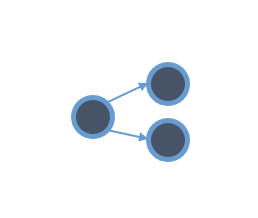

# MothMotifs

Network analysis techniques (such as network motif theory) could be used to further compare the pruned networks and investigate the impacts of neural network structure on a control task. Network motifs are statistically significant substructures in a network and have been shown to be indicative of network functionality in control systems \cite{Hu_2018}.

Complex networks across many domains (ecological food webs, neural systems, electrical circuits) are made up of statistically significant, subgraphs called network motifs. Network motifs are described by the number of nodes they involve and the nature of the connections in-between the nodes (e.g., directed, or bi-directed). The order of the motif is defined by the number of nodes it involves (i.e. n-order motif involves n+1 nodes). For example, a second-order diverging motif involves 3 nodes: 

A subgraph must be statistically significant over a randomly connected graph to be considered a network motif of a given network. One metric for determining a subgraph’s statistical significance is its z-score when compared to randomly connected graphs. 

Here, we are quantifying the network motif distribution over the sparse networks pruned in [ref paper]. We have developed our own subgraph counting algorithm based around using the masking matrices of the pruned networks. Network motifs are determined by calculating the z-score against random networks with the same number of nodes, connections, and layer structure. 

