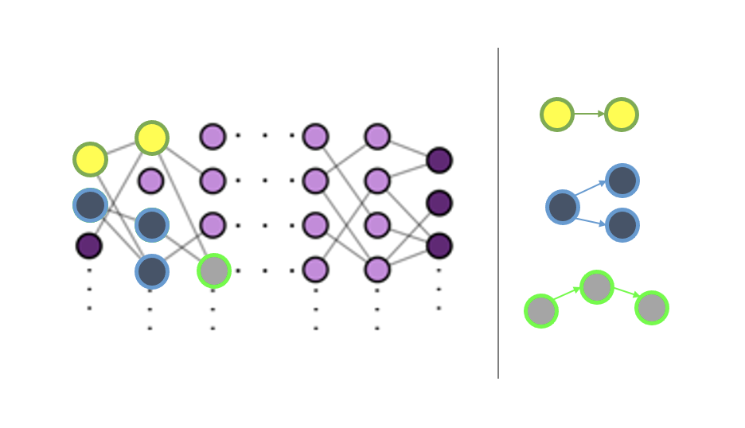

# MothMotifs

This project builds off of previous work published in [[1]](#1) and uses pruned neural networks trained to model insect flight. A description of [[1]](#1), as well as all code used to generate sparse neural networks for use in this project, can be found in [this Github repository](https://github.com/oliviatessa/MothPruning#mothpruning). 

  

## Background

Complex networks across many domains (ecological food webs, neural systems, electrical circuits) are made up of statistically significant, subgraphs called network motifs. Network motifs are described by the number of nodes they involve and the nature of the connections in-between the nodes (e.g., directed, or bi-directed). The order of the motif is defined by the number of nodes it involves (i.e. n-order motif involves n+1 nodes). For example, a second-order diverging motif involves 3 nodes: 

  

A subgraph must be statistically significant over a randomly connected graph to be considered a network motif of a given network. One metric for determining a subgraph’s statistical significance is its z-score when compared to randomly connected graphs.

Network motifs have been shown to be indicative of network functionality in control systems [[2]](#2). Quatifiying the distribution of the network motifs of a sparse neural network trained for a control task (i.e., insect flight) may give us insight to the network substructures necessary for biological control tasks. 

## Project Description

Here, we are quantifying the network motif distribution over the sparse networks pruned in [[1]](#1). These networks were trained to model insect flight control and were sparsified via neural network pruning. We have developed our own subgraph counting algorithm based around using the masking matrices of the pruned networks. Network motifs are determined by calculating the z-score against random networks with the same number of nodes, connections, and layer structure. 

## References
<a id="1">[1]</a> 
Zahn, Olivia, Jorge Bustamante Jr, Callin Switzer, Thomas L. Daniel, and J. Nathan Kutz. “Pruning deep neural networks generates a sparse, bio-inspired nonlinear controller for insect flight.” PLoS Computational Biology 18.9 (2022): e1010512. https://doi.org/10.1371/journal.pcbi.1010512

<a id="2">[2]</a> 
Hu, Yu, et al. "Feedback through graph motifs relates structure and function in complex networks." Physical Review E 98.6 (2018): 062312. https://journals.aps.org/pre/pdf/10.1103/PhysRevE.98.062312

